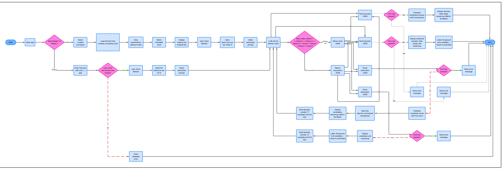
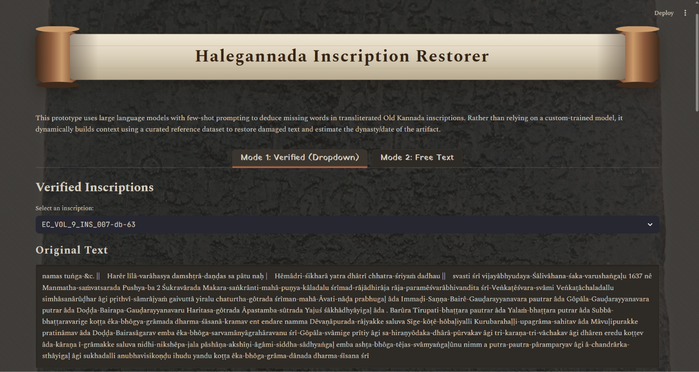
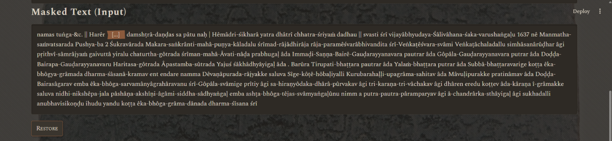
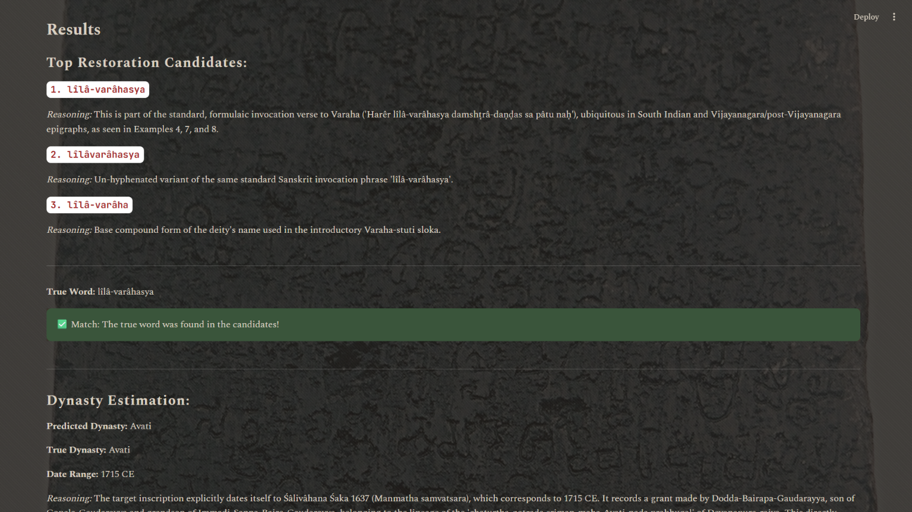
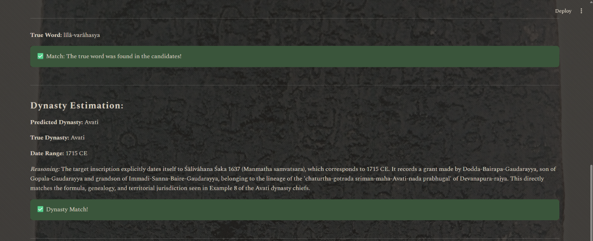
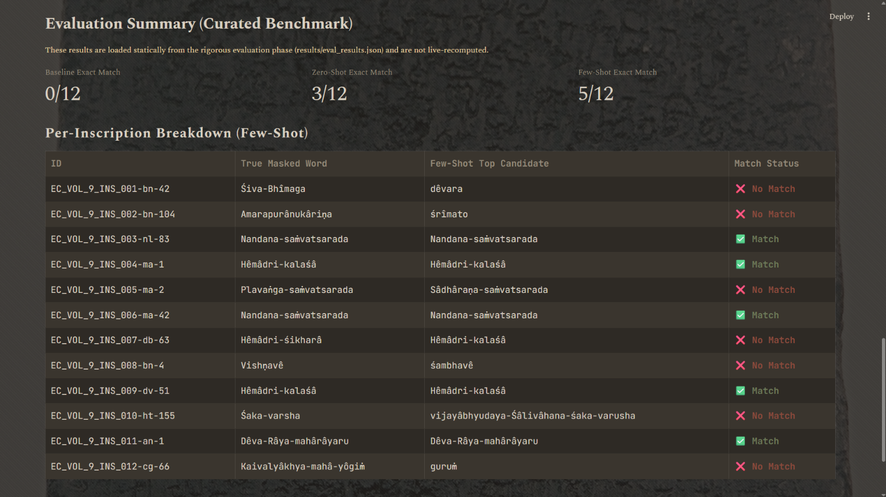
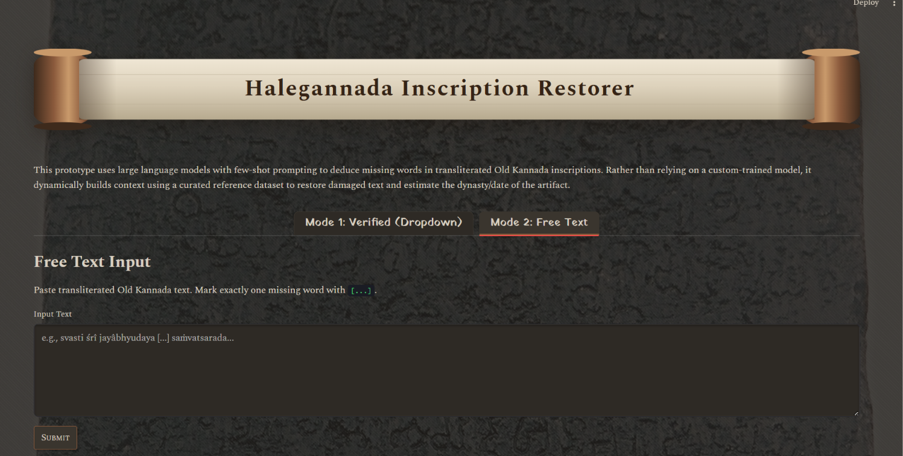

# 📜Halegannada Inscription Restorer

Old Kannada (Halegannada) inscriptions are a primary source for over a thousand years of Karnataka's history, but restoring damaged or illegible portions of them depends entirely on a small number of trained epigraphists. Ithaca and Aeneas developed by DeepMind for Ancient Greek and Latin scripts to help restore missing text or attribute an inscription to its period and dynasty. No such accessible tool currently exists for Indian scripts. This project is a first step toward closing that gap for Old Kannada.

## ❔What it does

Given a transliterated Old Kannada inscription with one word masked, the app suggests ranked candidate restorations and predicts the inscription's dynasty and date range, using in-context few-shot prompting over a hand-curated corpus. No fine-tuning, no OCR, no database. It runs in two modes: **Mode 1** picks a random word from a set of 12 verified inscriptions and checks the model's guess against the real, known text. **Mode 2** accepts any free-text inscription with a user-marked gap and returns an unverified prediction. The project also reports a three-way evaluation (frequency baseline vs. zero-shot vs. few-shot) rather than only showing plausible-looking output, so its accuracy claims are measurable, not just demoable.

## 💻Setup & running locally

1. Clone the repo and create a virtual environment.
2. `pip install -r requirements.txt`
3. Create a `.env` file with Gemini and Groq API keys (see `.env.example` if present, or the variable names used in `src/llm_client.py`).
4. `data/curated_inscriptions.json` and `results/eval_results.json` are already committed — no data prep or evaluation run is needed to launch the app.
5. `streamlit run app.py`

**If you add inscriptions to `curated_inscriptions.json`:** re-run `scripts/evaluate.py` to regenerate `results/eval_results.json`, and update the hardcoded inscription count in `app.py`'s evaluation summary section as it is not currently derived dynamically.

## 📚Data

Text is drawn from **Epigraphia Carnatica, Volume IX** (Bangalore District), compiled by B. Lewis Rice, sourced via the Internet Archive's [https://archive.org/details/epigraphiacarnat09myso/page/n7/mode/2up]digitized `hOCR` (formatted OCR text) and `djvu.xml` (word-level OCR with confidence scores) files. The hOCR text was used for the actual inscription passages; the XML confidence scores were used as a targeted trust check on the specific 12 inscriptions selected for the curated dataset, not as an automated filter over the full corpus.

12 inscriptions were manually curated and verified from this volume, covering the Ganga, Kalinga Ganga, Vijayanagara, Avati, Mysore (Wodeyar), and Belur dynasties (~700–1830 CE).

## 📌Methodology

1. Parsed Epigraphia Carnatica Vol. IX's hOCR output; cross-checked candidate inscriptions against djvu.xml OCR-confidence scores.
2. Manually curated and verified 12 inscriptions into `curated_inscriptions.json` (text, dynasty, date).
3. Built the gap-filling engine: prompt construction (`src/prompts.py`), LLM call and JSON parsing (`src/restore.py`).
4. Built a three-way evaluation loop (`scripts/evaluate.py`): frequency baseline, zero-shot, and few-shot restoration, each scored for exact-match and top-3 match, both raw and diacritic-normalized.
5. Extended the same reference-example pattern to dynasty/date prediction (`src/dynasty.py`).
6. Added a multi-provider LLM failover layer (`src/llm_client.py`) so all restoration and dynasty calls degrade gracefully across API keys and providers.
7. Built the Streamlit interface (`app.py`): Mode 1 (verified, ground-truth-checked), Mode 2 (free-text, unverified), and an evaluation summary view.

## Workflow

## 🧠Core logic

**Masking (Mode 1, `evaluate.py`):** Parenthetical editorial notes (e.g. plate-break markers) are stripped before a word is chosen, since they aren't part of the inscription text. From the remaining tokens, the selector skips words under 4 characters, a fixed list of formulaic/boilerplate words (invocations, land-grant verbs, honorific fragments), and a separate list of dynasty names and royal titles; the latter specifically so the model isn't handed the answer to the dynasty-prediction task through the masked word itself. Among what's left, capitalized tokens and longer words (≥6 characters) are preferred, on the heuristic that proper nouns and specific terms make more meaningful restoration targets than common words.

**Restoration engine:** `build_restoration_prompt` sends the masked text plus a set of reference inscriptions (text, dynasty, date) to the model, and requires a strict JSON response with up to 3 ranked candidates and reasoning for each. `build_dynasty_prompt` follows the same reference-example pattern to predict dynasty and date range.

**Baseline vs. zero-shot vs. few-shot prompting:**

- _Baseline_ is a plain word-frequency count across the reference inscriptions' text (minus a small exclusion list). It does not look at the masked context at all, and simply returns the single most common word in the corpus.
- _Zero-shot_ calls the restoration engine with no reference examples. The model relies only on general knowledge.
- _Few-shot_ calls the same engine with the other 11 curated inscriptions (Mode 1, leave-one-out) or all 12 (Mode 2) as in-context examples.

**Scoring:** Predictions are compared against ground truth both as raw strings and after diacritic normalization (circumflex ↔ macron, e.g. `î`/`ī`), at exact-top-1 and top-3 match.

## Workflow

## 🎯Results

- **Locked evaluation numbers:** Baseline 0/12, Zero-shot 3/12, Few-shot 5/12 exact match.
- Few-shot outperforms zero-shot, which outperforms the frequency baseline. This is consistent with the hypothesis that in-context examples meaningfully steer restoration, rather than the model simply guessing common words.
- During dynasty prediction, the model correctly converted a Śaka-calendar year from the source text to CE, on both Vijayanagara-era hits. This is unprompted reasoning, not memorized text since the specific date conversion couldn't have been seen precisely in pretraining, unlike restoration outputs.
- Dynasty prediction skews toward Vijayanagara, reflecting the corpus's composition (6 of 12 inscriptions are Vijayanagara-era). Sanskrit-vocabulary-heavy inscriptions are frequently guessed as Vijayanagara regardless of their actual dynasty.
- Mode 2 (free-text) testing against inscriptions outside the curated set produced plausible, contextually consistent guesses, but this is illustrative only. There is no ground truth for Mode 2 inputs, so no accuracy claim is made here.

## 📈Future scope

- **Data quality first:** ERC-DHARMA's critically-edited, TEI-encoded digital edition of Epigraphia Carnatica offers cleaner, scholar-verified ground truth than the hand-curated hOCR extraction used here.
- **Corpus expansion:** DHARMA would be the natural source for growing the corpus beyond the current 12 inscriptions and evening out dynasty representation.
- **Toward a trained model:** A larger, verified corpus opens the door to the more substantial goal this project stopped short of. This would transform it from pure in-context prompting toward actually training or fine-tuning a dedicated restoration model, the way Ithaca and Aeneas do.
- **Nearer-term extension:** Letting the few-shot example pool grow over time from verified Mode 2 submissions and then cross-checked against a source like DHARMA before being trusted, rather than staying frozen at the original 12.
- **Natural follow-ons:** Support for multiple masked spans per inscription, and broader geographic coverage beyond a single Epigraphia Carnatica volume, would follow from the same corpus-expansion effort.

## Acknowledgements

- Text data drawn from **Epigraphia Carnatica, Volume IX**, compiled by B. Lewis Rice; accessed via the **Internet Archive's** digitized hOCR and OCR-confidence files.
- **ERC-DHARMA** (CNRS), for its critically-edited digital edition of Epigraphia Carnatica, used for informal testing of Mode 2 against scholarly ground truth.
- Background image: Halmidi inscription (450 CE) photograph by Dineshkannambadi, CC BY-SA 3.0, via Wikimedia Commons.
